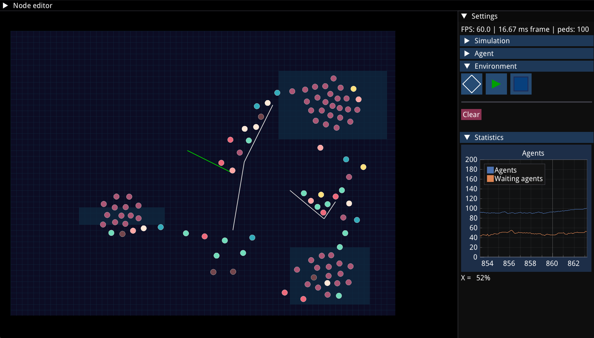
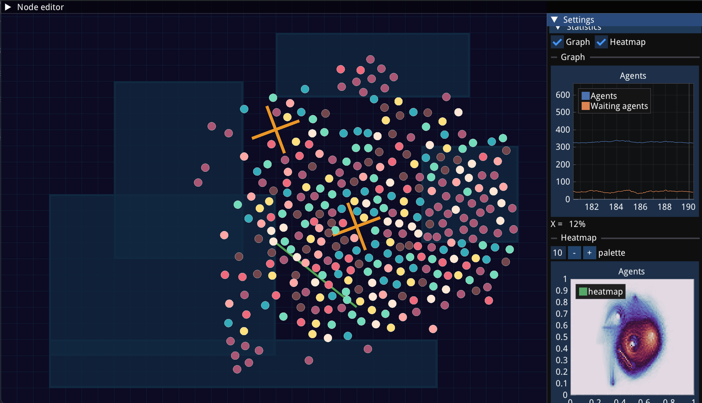
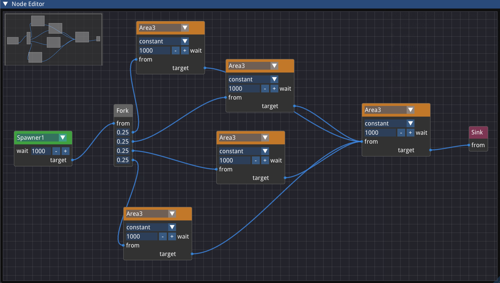

# Very quick pedestrian flow simulation

To view the paper we have written on this subject: [overleaf link](https://www.overleaf.com/project/66f667ffb591f8ff65cffdd8) (broken)

* Go to the [backlog](#project-backlog) to see the planned features.
* Go to [my previous Python implementation](htt ps://www.github.com/lmcuber/agentbasedmodel) without a node editor for some spaghetti code

# Previews




# Version support
⚠️ **This project currently supports `zig` versions up to 0.13.0.**  
Later Zig versions are not guaranteed to build correctly.

# Planned features
- [x] Social force model for pedestrians based on [the works](https://www.researchgate.net/publication/1947096_Social_Force_Model_for_Pedestrian_Dynamics) of _Helbing et al_.
- [x] A blueprint system
    - [x] Working nodes
    - [x] Persistence across runs
    - [ ] Deleting nodes and connections
- [ ] Statistics
    - [x] Showing number of (waiting) pedestrians
    - [ ] Heatmap showing bottlenecks during simulation
- [ ] Advanced environmental objects
    - [ ] queues
    - [x] revolving doors
- [ ] *A\** pathfinding for the pedestrians
- [ ] Quadtree for collisions

## Won't haves
- _**Any type of scripting support**_<br>
The project should maximize development time and ease of use. I might implement it later when I see that the base nodes in the editor aren't enough to express complex interactions that are complex enough.
- _**Others means of agent based simulation**_<br>
This refers to other businesses, such as transport systems and factory pipelines. Those are currently way beyond the scope of the project.

# How to run
```
./run.sh
```
for Unix (figure out yourself how to run that on Windows) or
```bash
zig build run
```
or
```bash
zigup run 0.13.0 build run
```
if you have [zigup](https://github.com/marler8997/zigup) installed.

## Disclaimer

This project uses the [zig-raylib-imgui-template](https://github.com/schmee/zig-raylib-imgui-template), and uses:
- `raylib-zig` (https://github.com/raylib-zig/raylib-zig)
- `zgui` (https://github.com/zig-gamedev/zgui)
- `rlImGui` (https://github.com/raylib-extras/rlImGui)
- `imnodesez` (https://github.com/rokups/ImNodes) (I wrote AI-generated zig bindings)
- `implot` (https://github.com/epezent/implot) (I wrote AI-generated zig bindings)
