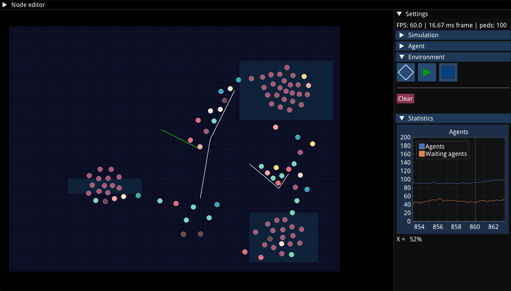
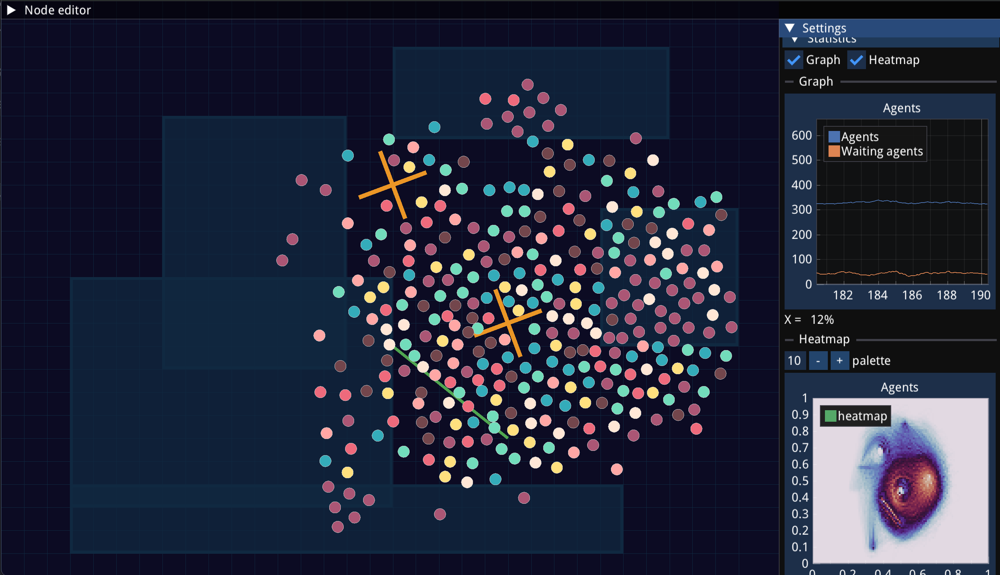
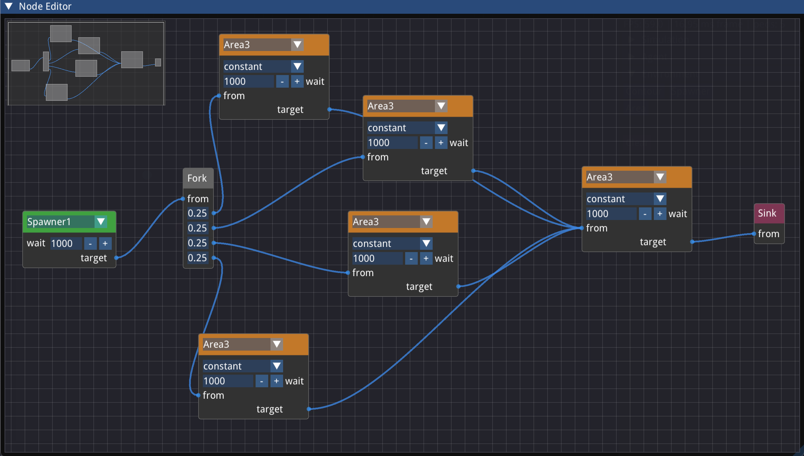
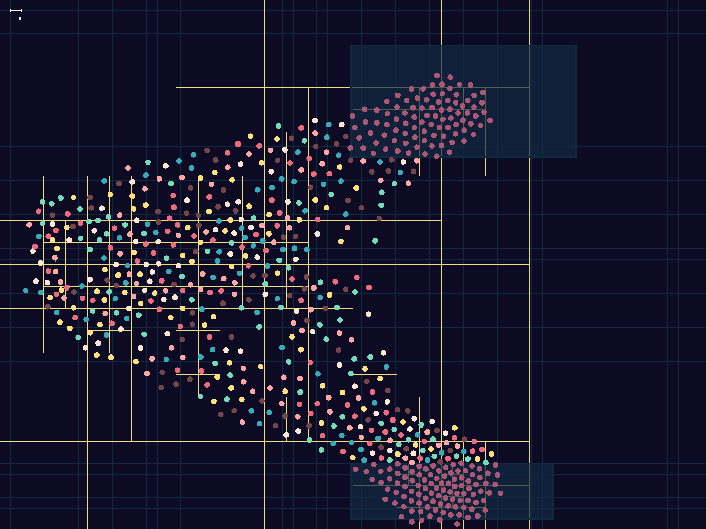

# Very quick pedestrian flow simulation

> [!WARNING]
> This project currently supports `zig` versions up to 0.13.0. Later Zig versions are not guaranteed to build correctly.

## Project philosopy
To view the paper we have written on this subject: [overleaf link](https://www.overleaf.com/project/66f667ffb591f8ff65cffdd8) (broken)

* Go to the [backlog](#project-backlog) to see the planned features.
* Go to [my previous Python implementation](https://www.github.com/lmcuber/agentbasedmodel) without a node editor for some spaghetti code

## Competitors
_AnyLogic_ (specifically the _Pedestrian Library_) is the only software I have used for an extended period of time, so this is the one I can talk about.
* The software is quite expressive, but setting up the simplest of things takes you through unintuitive mental hoops.
* The program (and the additional code you write) is in `Java` ☠️. This makes the simulation slower than a simulation written in a compiled language where the memory is manully managed (e.g. `zig`).
* The software looks very old and some operations are feel very janky to perform, such as configuring a custom agent profile and importing a database for arrival schedules (which broke at least 4 times when I was trying to import it).

## Defining features
- [x] Social force model for pedestrians based on [the works](https://www.researchgate.net/publication/1947096_Social_Force_Model_for_Pedestrian_Dynamics) of _Helbing et al_.
Simulations don't usually tell you the underlying physics model their agents. This project uses the above model with variable parameters.

- [ ] No-code system: as powerful scripting may be, the absolute last thing I wish upon my worst enemy is inspecting the implementation of a certain _AnyLogic_ `Node` class to find its size and find the correct method to call to change its position, just for it not to work in the end anyway.

- [ ] Built with optimization in mind: optimizing certain parameters of your simulation should not feel like coal mining with the source code - it should be built into the simulation software. _AnyLogic_ for example has decent support for optimization of _variables_, but it has a hard time modifying the location and dimensions of, for example, a waiting area.

- [ ] Realistic and easy-to-implement arrival schedule: in _AnyLogic_, arrival schedules can be imported as a dataset, for which I have to use another spreadsheet software (and tinker for hours with the formulas for the columns of arrival time, arrival rate, interarrival time). Arrival schedules are (almost always) either:
* _Poisson_ processes where the interarrival times are exponentially distributed, e.g. $f(x) = \lambda e^{-\lambda x}$
* Distributed according to a similar distribution with a different shape, e.g. the _Weibull_ distribution: $f(x) = \frac{k}{\lambda} \left(\frac{x}{\lambda}\right)^{k-1} \exp\left(-\left(\frac{x}{\lambda}\right)^k\right)$
While the former one is widely supported, the latter one is mostly underrepresented, all the while being very common in establishments such as airports or movie theaters, where the arrival pattern of pedestrians are determined by a schedule, rather than being relatively uniform (such as a carnival or a shop).

- [ ] Statistics
Statistics is the eventual reason we do agent based modeling. This should therefore very easily accessible, and the data should be easily extractable to be used for further analysis. Examples:
    - [ ] Showing the percentage of waiting pedestrians per waiting area/queue
    - [ ] Heatmap showing bottlenecks during simulation

- [ ] Quadtree for collisions
    _AnyLogic_ can become quite slow when simulating a lot of entities. _FlexSim_ uses a similar approach (_BVH_'s).

- [ ] Pathfinding for the pedestrians
In _AnyLogic_, pedestrians can get stuck behind corners and cause severe congestions, since they follow the shortest path in a straight line. This can be fixed by using direction objects, but this just makes it more indirect for the user and adds complexity for no reason.

## Won't haves
- _**Any type of scripting support**_<br>
The project should maximize development time and ease of use. I might implement it later when I see that the base nodes in the editor aren't enough to express complex interactions that are complex enough.
- _**Others means of agent based simulation**_<br>
This refers to other businesses, such as transport systems and factory pipelines. Those are currently way beyond the scope of the project.

> Jack of all trades, master of none, often better than a master of one, though it doesn't matter because in the end the simulation software didn't support revolving doors so I told the architect to scrap that idea.

# Previews

*Main view of the project*

*Another view, including heapmap*

*The node editor for pedestrian behavior modeling*

*The quadtree in action*

# How to run
```
./run.sh
```
for Unix (figure out yourself how to run that on Windows) or
```bash
zig build run
```
or
```bash
zigup run 0.13.0 build run
```
if you have [zigup](https://github.com/marler8997/zigup) installed.

> [!NOTE]
> This project uses the [zig-raylib-imgui-template](https://github.com/schmee/
> zig-raylib-imgui-template), and uses:
> - `raylib-zig` (https://github.com/raylib-zig/raylib-zig)
> - `zgui` (https://github.com/zig-gamedev/zgui)
>- `rlImGui` (https://github.com/raylib-extras/rlImGui)
> - `imnodesez` (https://github.com/rokups/ImNodes) (I wrote AI-generated zig bindings)
> - `implot` (https://github.com/epezent/implot) (I wrote AI-generated zig bindings)

> [!NOTE]
> Any criticism towards _AnyLogic_ in this readme is 30% caused by personal experience and 70% skill issues.
