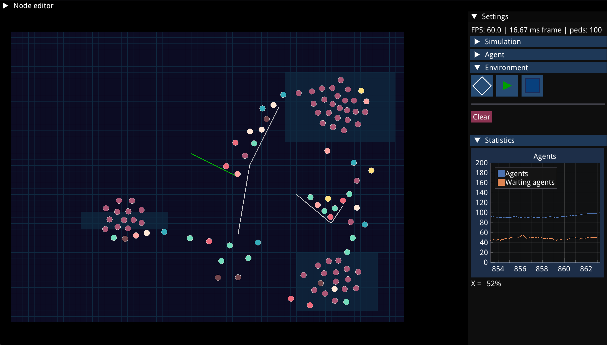
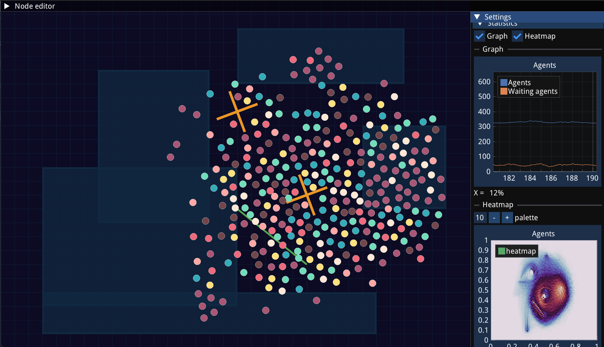
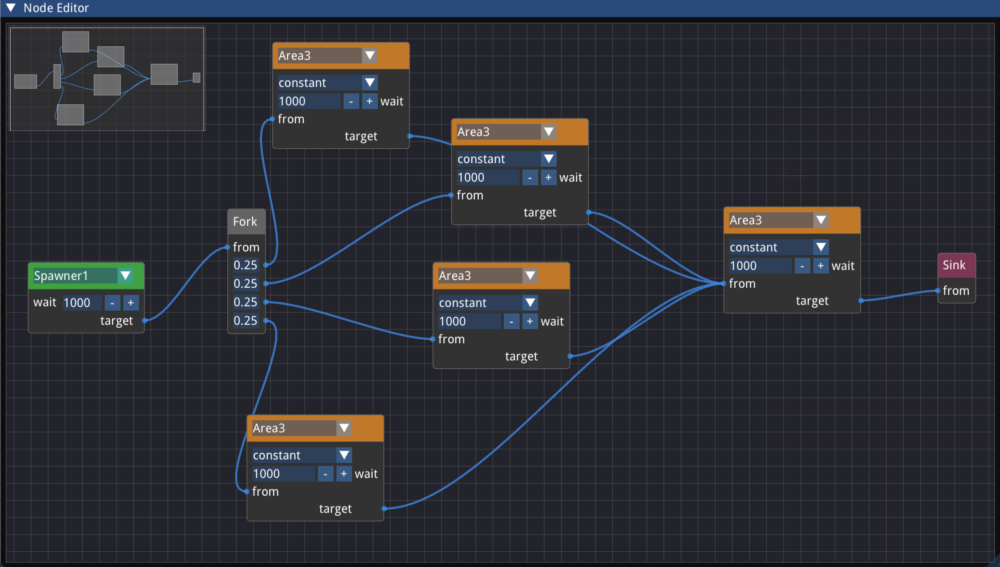
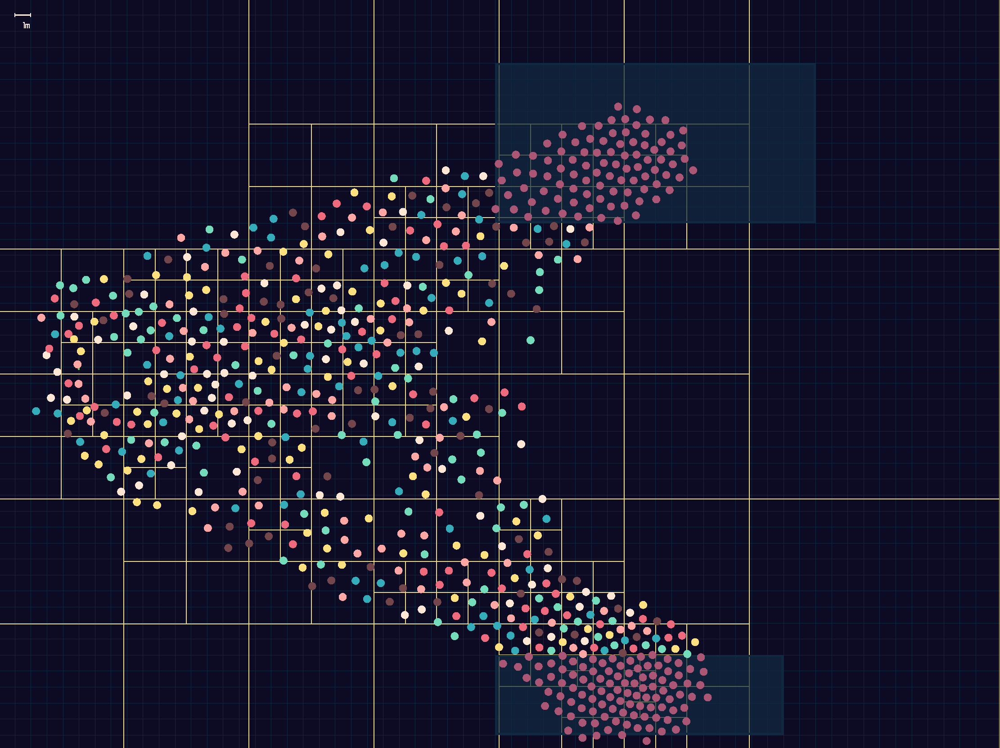

# Very quick pedestrian flow simulation

> [!NOTE]
> Thanks to the hard work of my dearest colleague, [dtasada](https://github.com/dtasada), the project now supports `zig 0.16` and is _NOT_ backwards compatible with older versions.

## Project philosopy
To view the paper we have written on this subject: [overleaf link](https://www.overleaf.com/project/66f667ffb591f8ff65cffdd8) (broken)

* Go to the [backlog](#project-backlog) to see the planned features.
* Go to [my previous Python implementation](https://www.github.com/lmcuber/agentbasedmodel) for the same project but without a node editor and some spaghetti code

## Competitors
_AnyLogic_ (specifically the _Pedestrian Library_) is the only software I have used for an extended period of time, so that is the one I can talk about.
* The software is quite expressive, but setting up the simplest of things takes you through unintuitive mental hoops.
* The program (and the additional code you write) is in `Java` ☠️. This makes the simulation slower than a simulation written in a compiled language where the memory is manully managed (e.g. `zig`).
* The software looks very old and some operations are feel very janky to perform, such as configuring a custom agent profile and importing a database for arrival schedules (which broke at least 4 times when I was trying to import my dataset).

## Defining features
- **Social force model for pedestrians based on [the works](https://www.researchgate.net/publication/1947096_Social_Force_Model_for_Pedestrian_Dynamics) of _Helbing et al._**

    Simulations don't usually tell you the underlying physics model their agents. This project uses the above model with variable parameters you can vary in the editor.
<br>
- **Ease-of-use**.

    As the name suggests, _QuickPed_ should be the first tool you take off your toolbelt when you want to prototype your agent based simulation &mdash; you can get a basic simulation up and running in minutes. This also means that the simulation is as explicit as possible: no hidden menus with different settings you didn't know played a role. The most important stuff is right in front of your face, and you can control every bit of it.
<br>
- **Built specifically for _optimization_.**

    Optimizing certain parameters of your simulation should not feel like hacking up a solution &mdash; it should be a part of the software itself.
    _AnyLogic_, for example, has decent support for optimization of simple units (such as number of), but it has a hard time modifying the location and dimensions of, for example, a waiting area.

    > Optimization comes up in the real world more often than you might think. For example: I have experience working at a movie theatre, where there were multiple domains where optimization is possible:
        > - Workers complaining about being stripped of one of their coffee machines, claiming it makes them slower during rush hour.
        > - Managers who want to rearrange the seaing positions in the main hall and add chairs to accomodate more people.
        > - The ticket scanner being annoyed that two of the three self-check-in kiosks are broken. Does it actually increase processing time?
    > These types of questions are harder to answer intuitively, since small effects can have unintuitive consequences.

- **_Realistic_ and _easy-to-implement_ arrival schedules.**

    In _AnyLogic_, arrival schedules can be imported as a dataset, for which I have to use another spreadsheet software (and tinker for hours with the formulas for the columns of arrival time, arrival rate, interarrival time). Arrival schedules are (almost always) either:
    * _Poisson_ processes where the interarrival times are exponentially distributed, e.g. $f(x) = \lambda e^{-\lambda x}$
    * Distributed according to a similar distribution with a different shape, e.g. the _Weibull_ distribution: $f(x) = \frac{k}{\lambda} \left(\frac{x}{\lambda}\right)^{k-1} \exp\left(-\left(\frac{x}{\lambda}\right)^k\right)$

    While the former one is widely supported, the latter one is mostly underrepresented, all the while being very common in establishments such as airports and movie theaters, where the arrival pattern of pedestrians are determined by a schedule, rather than being distributed in a "flat" fashion without huge peaks (such as a carnival or a shop). (Of course, airports have so many flights departing at (nearly) the same time such that the sum of all arrivals per gate can be approximated to be uniformly distributed. But for smaller establishments such as movie theaters, there are defined peaks and valleys.)
<br>
- **Statistics**.

    This is the eventual reason we do agent based modeling. This should therefore very easily accessible, and the data should be easily extractable to be used for further analysis. Examples:
    - [ ] Showing the percentage of waiting pedestrians per waiting area/queue
    - [ ] Heatmap showing bottlenecks during simulation
<br>
- **Performance.**

    _AnyLogic_ can become quite slow when simulating a lot of entities. _FlexSim_ uses a similar approach ([BVH's](https://en.wikipedia.org/wiki/Bounding_volume_hierarchy)). Since there can easily be tens of thousands of people in a single point in time in an airport, optimization measures should not be thought of lightly.
<br>
- **Good pathfinding for the pedestrians.**  

    _AnyLogic_'s _Pedestrian Library_ is supposed to be a black box, but after careful observation it seems like it uses a [visibility graph](https://en.wikipedia.org/wiki/Visibility_graph) approach combined with some sort of heuristic. This visibility graph approach has 2 main drawbacks:
    - Constructing a visibility graph is an `O(n^{2})` operation. This is usually slower than a partition-based algorithm 
    - 

## Won't haves
- Any type of scripting support:
the project should maximize development time and ease of use. Scripting will only be implemented when I am 100% sure the project has reached completion for be basic functionality, and it is missing out on being exploited logically by not having a scripting language. 

> Jack of all trades, master of none, often better than a master of one, until the simulation software doesn't support revolving doors so you have to tell the the architects to scrap that idea.

# Previews

*Main view of the project*

*Another view, including heapmap*

*The node editor for pedestrian behavior modeling*

*The quadtree in action*

# How to run
```
./run.sh
```
for Unix (figure out yourself how to run that on Windows) or
```bash
zig build run
```
or
```bash
zigup run 0.13.0 build run
```
if you have [zigup](https://github.com/marler8997/zigup) installed.

> [!NOTE]
> This project uses the [zig-raylib-imgui-template](https://github.com/schmee/
> zig-raylib-imgui-template), and uses:
> - `raylib-zig` (https://github.com/raylib-zig/raylib-zig)
> - `zgui` (https://github.com/zig-gamedev/zgui)
>- `rlImGui` (https://github.com/raylib-extras/rlImGui)
> - `imnodesez` (https://github.com/rokups/ImNodes) (I wrote AI-generated zig bindings)
> - `implot` (https://github.com/epezent/implot) (I wrote AI-generated zig bindings)

> [!NOTE]
> Any criticism towards _AnyLogic_ in this readme is 30% caused by personal experience and 70% skill issues.
