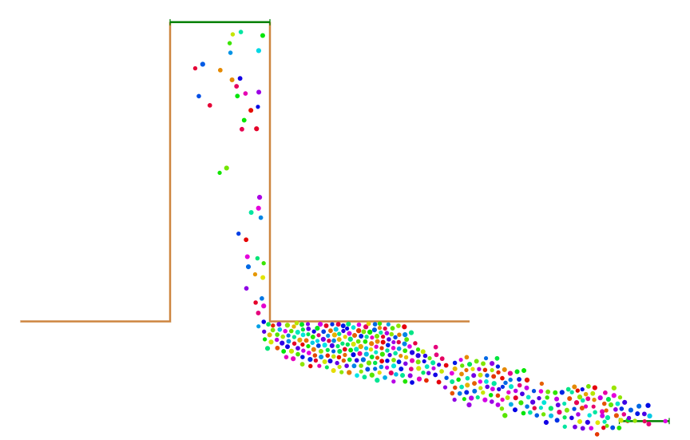

# Pathfinding

## Issue with _AnyLogic_

_AnyLogic_'s _Pedestrian Library_ is supposed to be a black box, but after careful observation it seems like it uses a [visibility graph](https://en.wikipedia.org/wiki/Visibility_graph) approach (also known as _waypoints_) combined with some sort of heuristic. This visibility graph approach has drawbacks:
    - Constructing a visibility graph is _at best_ an `O(n^2)` operation, which is simpler but usually slower than a partition-based algorithm (which is usually `O(n log n)`)
    - In a very obstacle-dense environment, there will be `O(n^2)` edges. This wastes a lot of memory, since a lot of edge are redundant.
    - Since the vertices of the polygons are the paths the pedestrians follow, the pedestrians bunch up at the corners of a sharp turn. Below is an example from _AnyLogic_:
    
    This problem wouldn't have occured if the paths the pedestrians could take were not _only_ the vertices of the obstacles.

That's why in this project, we make use of _navigation meshes_ instead of _visibility graphs_.
- While visibility graphs can provably return the path with the shortest euclidean distance, real pedestrians often don't move in that way. Rather, pedestrians walk in the _general direction_ of the target, not necessarily closest to the nearest wall.
- Navigation meshes are usually faster to generate.

## Solution

> [!NOTE]
> It is also possible that they _did_ use _navigation meshes_, but used the [funnel algorithm](https://gamedev.stackexchange.com/questions/68302/how-does-the-simple-stupid-funnel-algorithm-work) to find the shortest euclidean path. In this case, the first two points don't stand anymore, but the last one still does.

In this project, the pathfinding consists of the following steps:
1. [Constrained Delaunay Triangulation](https://en.wikipedia.org/wiki/Constrained_Delaunay_triangulation) of the [convex hull](https://en.wikipedia.org/wiki/Convex_hull) of the environment &rarr; we obtain a navigation mesh
2. Merge the superfluous triangles into less convex polygons with an algorithm such as [Hertel-Mehlhorn](https://en.wikipedia.org/wiki/Polygon_partition) &rarr; we obtain a less complex graph
3.